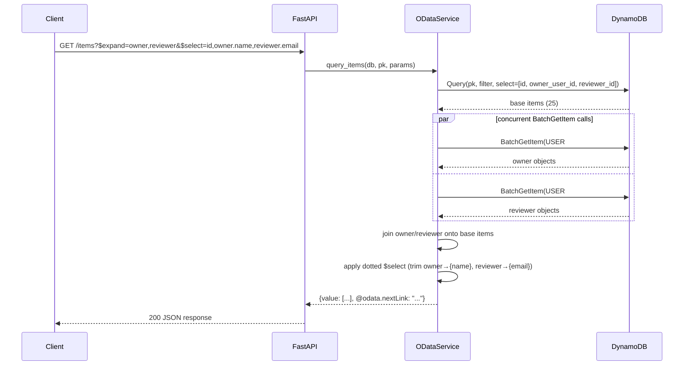

# $expand flow diagram

Sequence diagram for a single `$expand` request end-to-end.

```mermaid
sequenceDiagram
    participant Client
    participant FastAPI
    participant ODataService
    participant DynamoDB

    Client->>FastAPI: GET /items?$expand=owner,reviewer&$select=id,owner.name,reviewer.email
    FastAPI->>ODataService: query_items(db, pk, params)

    ODataService->>DynamoDB: Query(pk, filter, select=[id, owner_user_id, reviewer_id])
    DynamoDB-->>ODataService: base items (25)

    par concurrent BatchGetItem calls
        ODataService->>DynamoDB: BatchGetItem(USER#tenant, sks=[USER#alice, USER#bob, ...])
        DynamoDB-->>ODataService: owner objects
    and
        ODataService->>DynamoDB: BatchGetItem(USER#tenant, sks=[USER#carol, USER#dave, ...])
        DynamoDB-->>ODataService: reviewer objects
    end

    ODataService->>ODataService: join owner/reviewer onto base items
    ODataService->>ODataService: apply dotted $select (trim owner→{name}, reviewer→{email})

    ODataService-->>FastAPI: {value: [...], @odata.nextLink: "..."}
    FastAPI-->>Client: 200 JSON response
```
